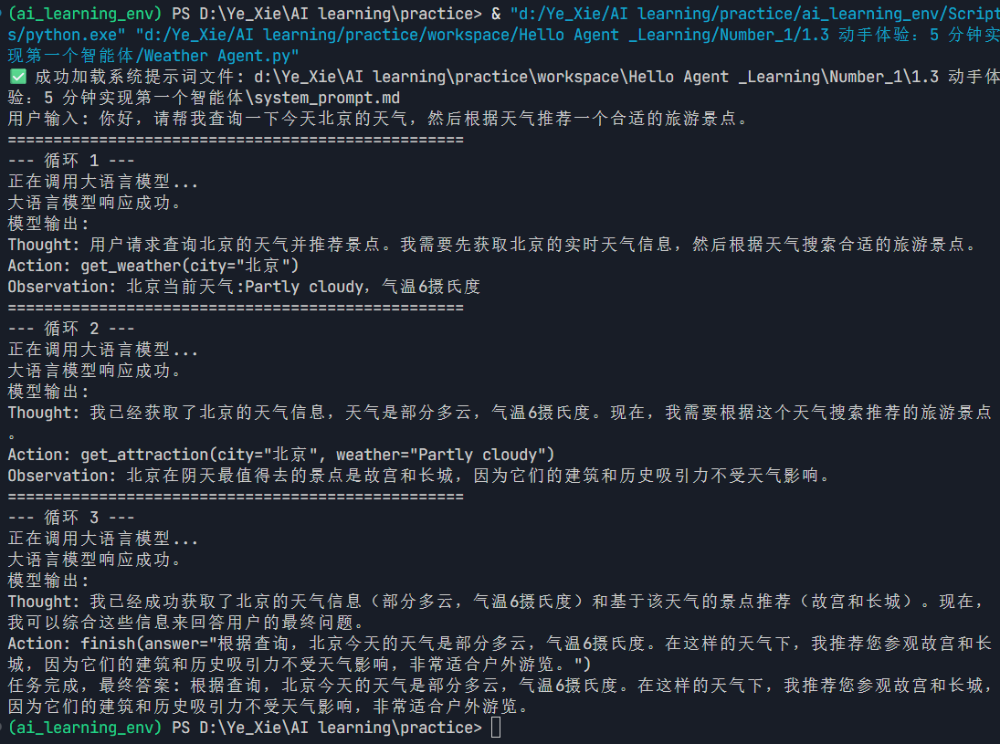

# 提示词加载Bug优化记录

[D.P]  作者声明：该文档由AI总结生成，所有通过"D.P"开头的内容为作者手动添加，作者修改过的内容会在文档中使用（D.P）标记。其它内容均为AI自动生成。

## 文档信息
- **文档名称**: 提示词加载bug优化.md
- **创建日期**: 2025-11-10
- **相关文件**: Weather Agent.py
- **问题类型**: 文件路径加载Bug

## 问题概述

### 初始问题
用户运行`Weather Agent.py`时出现终端报错："未找到提示词文件 system_prompt.md"
但确认文件确实存在于同一目录下。(D.P)

### 根本原因分析
代码中使用相对路径"system_prompt.md"加载提示词文件，导致在不同运行环境下因工作目录与脚本目录不一致而找不到文件。

## 优化过程记录

### 第一阶段：问题诊断

#### 1. 目录结构检查
```bash
目录结构：
├── Weather Agent.py
├── requirements.txt
└── system_prompt.md
```
确认文件确实存在于同一目录下。

#### 2. 代码分析
发现`load_system_prompt()`函数使用相对路径：
```python
def load_system_prompt():
    try:
        with open("system_prompt.md", 'r', encoding='utf-8') as f:
            return f.read().strip()
    except FileNotFoundError:
        return "默认提示词"
```

### 第二阶段：多环境兼容方案

#### 1. 智能路径搜索策略
重构`load_system_prompt()`函数，实现多路径尝试：

```python
def load_system_prompt():
    # 获取当前脚本所在的目录
    script_dir = os.path.dirname(os.path.abspath(__file__))
    
    # 尝试多个可能的文件路径
    possible_paths = [
        os.path.join(script_dir, "system_prompt.md"),  # 同目录下
        "system_prompt.md",  # 当前工作目录
        os.path.join(os.getcwd(), "system_prompt.md"),  # 绝对路径
    ]
    
    # ==================== 通过打印信息区分 ====================
    # 通过控制台输出的路径信息可以清晰区分文件是从哪个代码路径加载成功的：
    # 1. 脚本目录路径：由第20-21行的script_dir计算 + 第24行的os.path.join(script_dir, "system_prompt.md")
    #    - 输出示例：✅ 成功加载系统提示词文件: d:\...\system_prompt.md
    # 2. 当前工作目录路径：直接由第25行的"system_prompt.md"提供
    #    - 输出示例：✅ 成功加载系统提示词文件: system_prompt.md
    # 3. 绝对路径：由第26行的os.path.join(os.getcwd(), "system_prompt.md")提供
    #    - 输出示例：✅ 成功加载系统提示词文件: d:\当前工作目录\system_prompt.md
    # 
    # 搜索优先级：脚本目录 > 当前工作目录 > 绝对路径
    # 实际应用场景：
    # - 从脚本目录运行：通常会从"脚本目录"路径加载成功
    # - 从其他目录运行：可能会从"当前工作目录"或"绝对路径"加载成功
    # - 调试时：通过打印信息可以清楚知道文件是从哪个路径找到的
    
    for prompt_file in possible_paths:
        try:
            with open(prompt_file, 'r', encoding='utf-8') as f:
                prompt_content = f.read().strip()
            print(f"✅ 成功加载系统提示词文件: {prompt_file}")
            return prompt_content
        except FileNotFoundError:
            continue
        except Exception as e:
            print(f"❌ 错误: 读取提示词文件 {prompt_file} 时发生错误 - {e}")
            continue
    
    # 如果所有路径都失败，返回默认提示词
    print("⚠️  警告: 未找到提示词文件，使用内置默认提示词")
    return "默认提示词"
```

#### 2. 错误处理机制
- **FileNotFoundError**: 使用`continue`继续尝试下一个路径
- **其他异常**: 记录错误信息后继续尝试
- **优雅降级**: 所有路径失败时返回默认提示词

### 第三阶段：代码规范优化
 
#### 1. 导入语句清理
发现并修复了以下问题：
- 第8行和第9行重复的`import requests`
- 函数内部重复导入`import os`和`import sys`

[D.P] 这个问题应该会随着大模型的迭代而解决，使用适当的提示词或上下文也可以解决，出现这个问题的时候，我并没有对Trae的上下文规则进行设定，还有智能体采用内置的Builder，所以出现该问题。这个问题在Trae的官方的Meetup分享会上也有大佬提过，也分享过解决方案，视频中分享的相关问题更全，具体可以搜索抖音视频，关键词”顺畅编码，远离屎山“。

#### 2. PEP 8规范符合
- 将所有导入语句移到文件顶部
- 删除函数内部的不规范导入

### 第四阶段：技术细节解析

#### 1. `continue`语句的作用分析
```python
except FileNotFoundError:
    continue  # 文件不存在，继续尝试下一个路径
```

[D.P]  以下两个问题为调试代码过程中对于AI写的代码的逻辑不明白的地方进行更深入的询问，与上文有些许重复，保留原因为这其实是我与AI的对话历程，在看到AI写的代码之后，没明白这个地方为什么要用continue，这些历程可以更好的帮助我与AI沟通。

**为什么使用`continue`？**
- **多路径尝试策略**: 确保按优先级顺序尝试所有可能的路径
- **搜索优先级逻辑**: 脚本目录 > 当前工作目录 > 绝对路径
- **与`return`的配合**: 成功时立即返回，失败时继续搜索

**如果不用`continue`会怎样？**
- 使用`break`: ❌ 会立即终止整个循环，无法尝试其他路径
- 使用`pass`: ✅ 效果与`continue`相同，但语义不如`continue`明确

#### 2. 实际执行流程
1. **尝试路径1**（脚本目录）→ 文件存在 → `return` → 结束
2. **尝试路径1** → 文件不存在 → `continue` → 尝试路径2
3. **尝试路径2**（工作目录）→ 文件存在 → `return` → 结束
4. **尝试路径2** → 文件不存在 → `continue` → 尝试路径3  
5. **尝试路径3**（绝对路径）→ 文件存在 → `return` → 结束
6. **所有路径都失败** → 循环结束 → 返回默认提示词

## 优化效果

### 1. 多环境兼容性
- ✅ 从脚本目录运行：正常加载
- ✅ 从其他目录运行：正常加载  
- ✅ 跨平台兼容：Windows/Linux/macOS

### 2. 错误处理能力
- ✅ 文件不存在：优雅降级到默认提示词
- ✅ 权限问题：记录错误信息
- ✅ 编码问题：UTF-8编码处理

### 3. 调试友好性
- ✅ 清晰的路径加载信息
- ✅ 详细的错误日志
- ✅ 搜索优先级可视化

## 测试建议

### 1. 从脚本目录运行
```bash
cd "/d:/Ye_Xie/AI learning/practice/workspace/Hello Agent _Learning/Number_1/1.3 动手体验：5 分钟实现第一个智能体"
python "Weather Agent.py"
```
**预期结果**: 从脚本目录路径加载成功

### 2. 从其他目录运行
```bash
cd "/d:/Ye_Xie/AI learning/practice"
python "workspace/Hello Agent _Learning/Number_1/1.3 动手体验：5 分钟实现第一个智能体/Weather Agent.py"
```
**预期结果**: 从当前工作目录或绝对路径加载成功

## 实践结果
[D.P]  实践结果为作者手动添加，因为AI写了几遍也没写对，主要表现为插入截图失败，无法显示，原因还在找。

### 1. 初始测试（未配置API）
在首次运行Weather Agent.py时，由于未提前配置API密钥，程序通过人机互动方式提示用户输入API密钥。

**失败截图**:


**问题描述**:
- 程序检测到未配置API密钥
- 通过交互式提示要求用户输入API密钥
- 由于未提前配置，导致运行中断

#### 2. 手动配置后测试
在手动配置API密钥后，重新运行程序，成功加载提示词文件并正常运行。

**成功截图**:



## 总结

通过本次优化，我们成功解决了提示词文件加载的多环境兼容问题：

1. **问题定位准确**: 识别出相对路径导致的文件查找失败
2. **解决方案完善**: 实现智能路径搜索和优雅降级机制
3. **代码质量提升**: 符合PEP 8规范，增强可维护性
4. **用户体验优化**: 提供清晰的调试信息和错误处理

优化后的代码具有更好的健壮性和多环境兼容性，为后续开发奠定了良好基础。